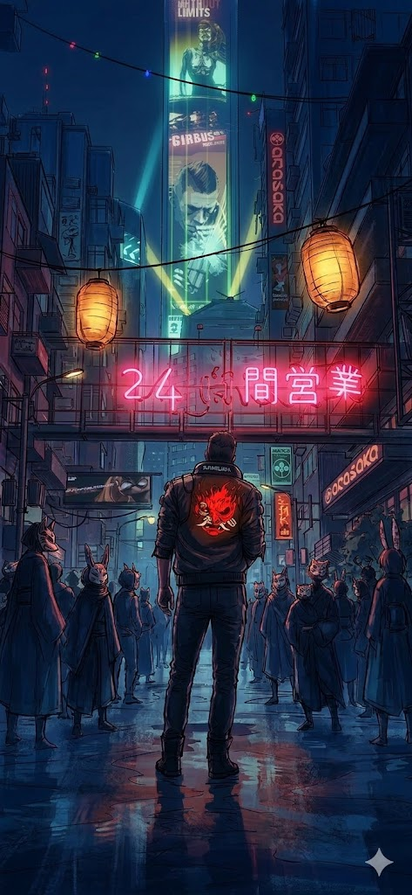

  

 

I am Guandalinux an enthusiastic and ambitious systems engineering devops.
Logic dictates that I automate to work less. In reality, I don’t work less—I’m just expanding my empire of automated bugs. The infinite loop is real. ♾️

---
## 💻 My top open source projects

<table width="100%" border="0">
  <tr>
    <td width="60%" valign="top">
      
      
    </td>
    <td width="40%" valign="top" align="center">
      
    </td>
  </tr>
</table>

---
## 🛠️ My Skills

### Cloud

### Virtualization

  

### Infra as code

  
  
    
  

### CI/CD

### Monitoring

  
  

### Orchestration

  

 